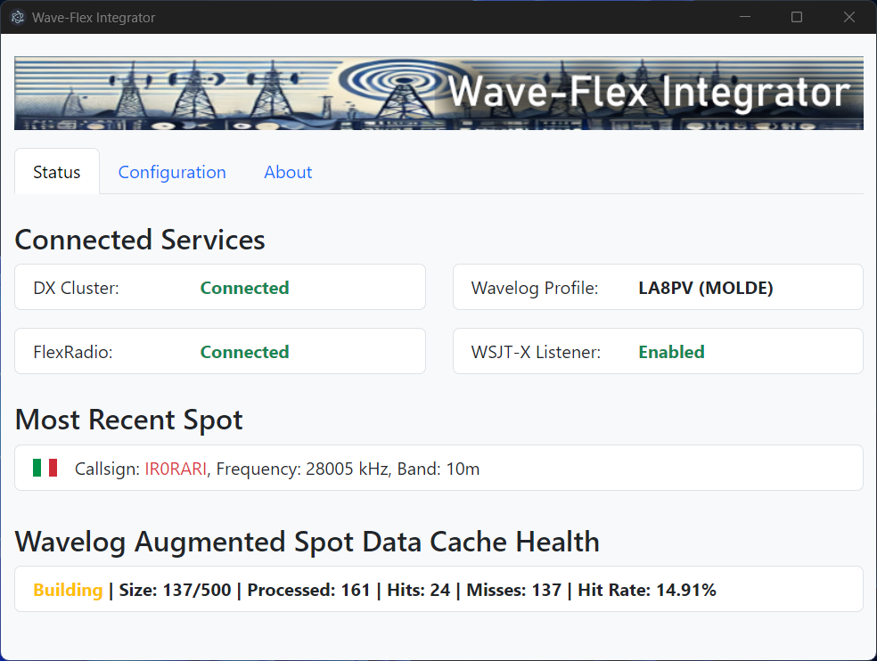
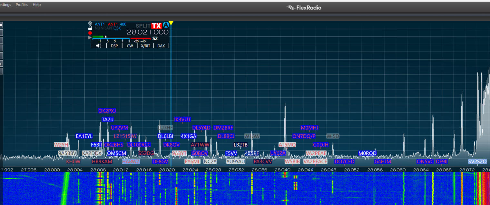
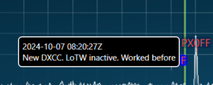
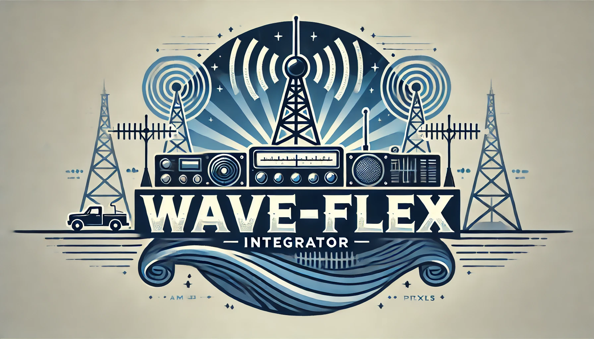

# Wave-Flex Integrator

[](LICENSE)
[](https://nodejs.org/)
[](#)

*A seamless bridge between your FlexRadio and Wavelog logging software, integrating DX Cluster data, WSJT-X and synchronizing frequency and mode, all without traditional CAT software.*



> **Note:** This software is currently in beta testing. Features and documentation may change as the project evolves.

---

## Table of Contents

- [Introduction](#introduction)
- [Features](#features)
- [What is Wave-Flex Integrator?](#what-is-wave-flex-integrator)
- [What is Wavelog?](#what-is-wavelog)
  - [Try Wavelog Before You Commit](#try-wavelog-before-you-commit)
- [Requirements](#requirements)
  - [FlexRadio Compatibility](#flexradio-compatibility)
  - [SmartSDR Versions and Compatibility](#smartsdr-versions-and-compatibility)
- [Installation](#installation)
  - [Windows Installation](#windows-installation)
  - [Linux Installation](#linux-installation)
  - [macOS Installation](#macos-installation)
- [Auto-Updating](#auto-updating)
- [Configuration](#configuration)
  - [Configuration Parameters](#configuration-parameters)
- [Usage](#usage)
  - [Security Warning on First Startup (Windows and macOS)](#security-warning-on-first-startup-windows-and-macos)
- [How DXCC Confirmation is Determined](#how-dxcc-confirmation-is-determined)
- [Debugging and Troubleshooting](#debugging-and-troubleshooting)
  - [Enable Debug Mode](#enable-debug-mode)
  - [Reproduce the Issue](#reproduce-the-issue)
  - [Locate the `debug.log` File](#locate-the-debuglog-file)
  - [Send the `debug.log` File](#send-the-debuglog-file)
  - [Additional Troubleshooting Tips](#additional-troubleshooting-tips)
- [Contributing](#contributing)
- [License](#license)
- [Acknowledgments](#acknowledgments)

---

## Introduction

Wave-Flex Integrator simplifies your ham radio setup by directly connecting your **FlexRadio** to the **Wavelog** web-based logging software. It integrates DX Cluster data, enhances spot information, and synchronizes your frequency and mode, optionally integrates WSJT-X, all without the need for traditional CAT software.



When a spot appears on your SmartSDR panadapter, not only does it display important information through color-coding and opacity, but hovering your mouse pointer over the spot will also reveal a popup with detailed information about the station, including DXCC status, worked-before status, and LoTW membership. This provides an immediate, clear overview of each spot without having to rely solely on visual cues.



Additionally, when you click on a spot, a pre-filled Wavelog logging window will automatically open in your browser, ready to log the QSO. This seamless integration allows you to focus more on operating and less on managing multiple applications.

> **Note:** The TNXQSO team is not affiliated with **Wavelog** or **FlexRadio**. This project is independently developed to integrate free of charge tools for the ham radio community. We exist only here on GitHub.

---

## Features

- **DX Cluster Integration**: Connects to a DX Cluster to receive real-time spot data.
- **Spot Augmentation**:
  - Enriches spot data using the Wavelog API.
  - Indicates whether a callsign's DXCC is needed for the band or mode.
  - Shows if the station is a **LoTW** (Logbook of The World) member.
- **WSJT-X Integration**:
  - Detects active QSOs and displays details of the current callsign being worked in Wavelog's live logging tab (fully configurable and optional).
  - Automatically logs completed QSOs from WSJT-X ADIF broadcasts directly into Wavelog (fully configurable and optional).
- **Color-Coded Spots**:
  - Sends data enriched, color-coded spots to your FlexRadio, visible on your SmartSDR panadapter.
  - Customize colors and transparency based on DXCC status, worked-before status, and LoTW membership.
- **One-Click Logging**:
  - **SmartSDR for Windows**: Clicking a spot opens a pre-filled Wavelog logging window.
  - **SmartSDR for Mac/iOS**: Due to software limitations, this feature is not available.
- **Seamless Sync**: Automatically synchronizes frequency and mode between FlexRadio and Wavelog without CAT software.
- **Error Handling**: Reconnects automatically if the connection to the DX Cluster or FlexRadio drops.
- **Cross-Platform Support**: Aims to support Windows, macOS, and Linux.

---

## What is Wave-Flex Integrator?

Wave-Flex Integrator is a powerful tool designed to enhance your ham radio experience by bridging the gap between your FlexRadio and Wavelog logging software. By integrating DX Cluster data and enriching it with additional information via the Wavelog API, it provides you with real-time, actionable data directly on your SmartSDR panadapter.

---

## What is Wavelog?

**Wavelog** is a free, web-based logging software for ham radio enthusiasts. Feature-rich and easy to set up, Wavelog can be hosted on your own server at no cost, or you can opt for affordable hosting services.

- **Install on Your Own Server**: Full control over your logging software with free setup.
- **Hosted Solutions**: Affordable services that handle server administration and updates.

### Try Wavelog Before You Commit

New to Wavelog? Explore its features on their demo page:

[**Wavelog Demo**](https://demo.wavelog.org/user/login)

The demo provides a hands-on experience to see if Wavelog suits your needs.

---

## Requirements

- **FlexRadio**: Compatible FlexRadio device (FLEX-6000-series) connected to your LAN or reachable over TCP/IP.
- **SmartSDR**: Installed and running on your local machine. Compatibility varies by version (see below). In the SmartSDR menu, make sure to set Settings --> Spots to `Enabled` and make sure you don't override Colors or Background.
- **Wavelog**: Installed and running (Version 1.8.6 or later).
- **DX Cluster Access**: A DX Cluster server accessible via Telnet. Find one [here](http://www.dxcluster.info/telnet/index.php).

### FlexRadio Compatibility

- **Supported Models**: All FlexRadio models that support TCP/IP communication.
- **Network Access**: The FlexRadio must be reachable from the machine running Wave-Flex Integrator.

### SmartSDR Versions and Compatibility

Wave-Flex Integrator communicates directly with the FlexRadio hardware, making it independent of the SmartSDR version used. However, some features depend on the capabilities of your SmartSDR software:

- **SmartSDR for Windows** (Developed by FlexRadio Systems):
  - [Download SmartSDR for Windows](https://www.flexradio.com/ssdr/)
  - **Click-to-Log Feature**: Fully supported. Clicking a spot opens a pre-filled Wavelog logging window.

- **SmartSDR for Mac** (Developed by Marcus & Jan Roskosch):
  - [SmartSDR for Mac](https://roskosch.de/smartsdr-for-mac/)
  - **Click-to-Log Feature**: **Not supported** due to software limitations. SmartSDR for Mac does not send information about clicked spots back to the FlexRadio, preventing Wave-Flex Integrator from triggering the logging action.

- **SmartSDR for iOS** (Also by Marcus & Jan Roskosch):
  - [SmartSDR for iOS](https://roskosch.de/smartsdr-features/)
  - **Click-to-Log Feature**: **Not tested**, but expected to have the same limitations as the Mac version.

- **FlexRadio M-Series** (Radios with integrated touchscreens):
  - **Click-to-Log Feature**: **Not tested**. Functionality may vary.

> **Important Note:** While the Wave-Flex Integrator is compatible with various versions of SmartSDR, the one-click logging feature is only available when using SmartSDR for Windows and probably also when using FlexRadio M-Series touch screen instead of SmartSDR.

---

## Installation

### Windows Installation

Wave-Flex Integrator binaries for Windows are available on the [GitHub Releases](https://github.com/tnxqso/wave-flex-integrator/releases) page.

1. **Download**: Get the latest Windows installer (`.exe` file) from the [Releases](https://github.com/tnxqso/wave-flex-integrator/releases) page.

2. **Install**: Run the installer and follow the on-screen instructions.

3. **Launch**: After installation, launch Wave-Flex Integrator from the Start Menu or Desktop shortcut.

### Linux Installation

Wave-Flex Integrator binaries for Linux are available on the [GitHub Releases](https://github.com/tnxqso/wave-flex-integrator/releases) page.

1. **Download**: Get the latest Linux package from the [Releases](https://github.com/tnxqso/wave-flex-integrator/releases) page.

2. **Install**: Use your distribution's package manager to install the application.

   For Debian-based distributions (Ubuntu, Debian):

   ```bash
   sudo dpkg -i wave-flex-integrator_1.0.0_amd64.deb
   ```

   For RPM-based distributions (Fedora, CentOS):

   ```bash
   sudo rpm -i wave-flex-integrator-1.0.0.x86_64.rpm
   ```

3. **Launch**: Start Wave-Flex Integrator from your applications menu or by running `wave-flex-integrator` from the terminal.

### macOS Installation

Wave-Flex Integrator binaries for macOS are available on the [GitHub Releases](https://github.com/tnxqso/wave-flex-integrator/releases) page.

1. **Download**: Get the latest macOS installer (`.dmg` file) from the [Releases](https://github.com/tnxqso/wave-flex-integrator/releases) page.

2. **Install**: Open the downloaded `.dmg` file and drag the Wave-Flex Integrator icon into your `Applications` folder.

3. **Launch**: After installation, you can launch Wave-Flex Integrator from the `Applications` folder or using Spotlight search.

---

## Auto-Updating

Wave-Flex Integrator includes an auto-update feature that automatically downloads and installs new versions as they become available. Simply restart the application to apply updates—no manual intervention is required.

---

## Configuration

Upon first startup, no services gets connected. This is normal. Configure the application via the **Configuration Tab**, save your settings, and restart the application.

### Configuration Parameters

#### DX Cluster Settings

- **Host**: The hostname or IP address of the DX Cluster server.
- **Port**: The port number for the server connection (typically 7300 or 7373).
- **Callsign**: Your amateur radio callsign (for logging in to DX Cluster only).
- **Login Prompt**: The prompt expected from the server for login, such as `login:`, `User:`, or `Login:`. The default is usually `login:`. Make sure the letter case and use of `:` are correct. You can verify the prompt using a Telnet client like [PuTTY](https://www.putty.org/) if connecting to a different server.
- **Commands After Login**: Optional commands to be executed after logging in. Provide a comma-separated list of commands. The default commands are recommended unless you need specific customizations. You should alter it to reflect your details though.
- **Reconnect Settings**: Configure the reconnection behavior if the connection is lost.

> **Tip:** Use a separate DX Cluster server for Wave-Flex Integrator to prevent conflicts with other applications. You can test connectivity using a Telnet client like [PuTTY](https://www.putty.org/).

#### FlexRadio Settings

- **Enabled**: Toggle FlexRadio integration.
- **Host**: FlexRadio's hostname or IP address.
- **Port**: Port number (default is 4992).
- **Spot Management**:
  - **Spot Age Limit**: Time after which spots are removed.
  - **Color Settings**: Customize spot colors based on criteria.

#### Wavelog Settings

- **BASE URL**: Your Wavelog API base URL (e.g., `https://YOURSERVER/index.php`). Typically, the ending part `/index.php` should be kept.
- **API Key**: Obtain from Wavelog under your account settings.
- **Station Location IDs**: Comma-separated IDs (optional).

#### WSJT-X Configuration

- **WSJT-X integration Enabled**: Toggle WSJT-X integration. If this is set to `false`, all WSJT-X functionality (including `Show QSO` and `Log QSO`) will be disabled, regardless of their individual settings.
- **UDP Listen Port**: The port on which the application listens for ADIF broadcasts from WSJT-X (default is 2237). Ensure this matches the port configured in WSJT-X for sending ADIF messages.
- **Show ongoing WSJT-X QSO in Wavelog live logging**: When this option and `WSJT-X integration Enabled` are both set to `true`, the details of the ongoing QSO will be displayed in Wavelog's live logging tab.

  While a logging window is opened in Wavelog for the purpose of displaying information about the callsign currently being worked, you are not required to manually complete the logging process in Wavelog. 

  Although it is technically possible to manually log the QSO at this stage, it is not necessary, nor recommended. The actual logging will happen automatically if you have enabled the `Log WSJT-X QSO in Wavelog` option. This automatic logging is triggered when WSJT-X sends an ADIF logging message at the end of the QSO.

- **Log WSJT-X QSO in Wavelog**: When both this option and ` WSJT-X integration Enabled` are set to `true`, completed QSOs from WSJT-X ADIF broadcasts will be automatically logged in Wavelog. In WSJT-X setting, general tab, the station details for `My Call` and `My Grid`must match those set in Wavelog for the Station Location marked as `Active Station`. If the `Avtive Station` is changed in Wavelog, Wave-Flex Integrator should be restarted to pick up the changes.

> **Note:** Both **Show ongoing WSJT-X QSO in Wavelog live logging** and **Log WSJT-X QSO in Wavelog** options only take effect if WSJT-X integration (` WSJT-X integration Enabled`) is set to `true`. If WSJT-X integration is disabled, these features will not function, even if individually enabled.

---

## Usage

Start the application by launching it from the Start Menu (Windows), the Applications menu (Linux), or by opening the **Applications** folder and double-clicking on **Wave-Flex Integrator** (macOS). On macOS you can also use **Spotlight** by pressing `Command + Space`, typing "Wave-Flex Integrator," and pressing `Enter` to launch the app.

Wave-Flex Integrator will connect to your DX Cluster and FlexRadio, enhance spots, and synchronize with Wavelog.

> **Note:** After Wave-Flex Integrator has started up for the first time and the first spot has been augmented by Wavelog, you need to go into Wavelog and navigate to Account > Hardware Interfaces. Select the newly created wave-flex-integrator to become the default interface.

### Security Warning on First Startup (Windows and macOS)

When you launch Wave-Flex Integrator for the first time, you may encounter a security warning on both Windows and macOS. This is expected, and you can safely proceed.

#### Windows: "Unknown Publisher" Warning
On Windows, you may see a warning that the app is from an "Unknown Publisher." This occurs because the application hasn't been signed with a verified certificate yet.

To continue:

1. Click **More info**.
2. Then click **Run anyway** to proceed with the installation.

Rest assured, the software is safe to use. We are working towards acquiring a verified publisher certificate to avoid this warning in future releases.

#### macOS: "Unidentified Developer" Warning
On macOS, a similar warning may appear saying that the app is from an "Unidentified Developer."

To run the app:

1. Open **System Preferences** > **Security & Privacy** > **General**.
2. You'll see a message saying that Wave-Flex Integrator was blocked because it's not from an identified developer. Click **Open Anyway**.
3. Confirm your choice by clicking **Open** in the dialog that appears.

This step is necessary because the app hasn't yet been signed with an Apple Developer certificate. We recommend doing this only for trusted applications like Wave-Flex Integrator.

#### Build the Application from Source
For users who prefer to build the application themselves, the full source code is available on the [GitHub repository](https://github.com/tnxqso/wave-flex-integrator). While we don't provide specific build instructions, users with the necessary experience can compile the application independently, giving them full control over the build process.

---

## How DXCC Confirmation is Determined

Wave-Flex Integrator seamlessly determines whether a DXCC entity is confirmed by querying your **Wavelog** installation. Wavelog, in turn, checks your configured QSL services to verify DXCC status. These settings can be found and adjusted in **Wavelog** under:

**Account** → **Default Values** → **Default QSL-Methods**

The QSL methods you have defined as default will dictate how DXCC confirmations are processed. For operators looking to apply for a **DXCC Award**, it's common to set **LoTW (Logbook of The World)** as the only QSL method, as LoTW is the official authority that grants DXCC awards. However, you can customize these methods based on your preferences and the types of confirmations you accept.

---

## Debugging and Troubleshooting

If you encounter issues, follow these steps to help diagnose and resolve them effectively.
``
### Check that Wavelog can be reached on the About tab

On the About tab, below the title **Wavelog Station Location** you should be able to see the `Station ID`, `Station Name`, `Station Grid Square` and `Station Callsign` fetched from the configured Wavelog server's `Active Station` in `Station Setup`. If there is no information you should check that your Wavelog server is up and running and that your configuration is correct. If you change the `Active Station` in Wavelog, you will need to restart the application to fetch the new values. The values you see here will be used by the application in various places.

### Ensure No Other Applications Are Creating Spots on the SmartSDR panadapter

Wave-Flex Integrator actively monitors and manages all spots displayed on the SmartSDR panadapter. To avoid conflicts or duplicate entries, make sure that no other applications are generating spots simultaneously. Additionally, only one instance of Wave-Flex Integrator should be connected to your FlexRadio at any given time to ensure operation and to avoid unexpected results.

### Enable Debug Mode

Run the application with debug logging:

- **Windows**: Launch the application from the command prompt with the `-- -- --debug` flag.

  ```bash
  "C:\Program Files\Wave-Flex Integrator\wave-flex-integrator.exe" -- -- --debug
  ```

- **Linux**: Run from terminal with the `-- -- --debug` flag.

  ```bash
  wave-flex-integrator -- -- --debug
  ```

- **macOS**: Run from terminal with the -- -- --debug flag:


  ```bash
  /Applications/Wave-Flex\ Integrator.app/Contents/MacOS/wave-flex-integrator -- -- --debug

  ```

This creates a `debug.log` file with detailed logs.

### Reproduce the Issue

Use the application until the problem occurs to ensure relevant information is logged.

### Locate the `debug.log` File

- **Windows**:

  ```
  C:\Users\<YourUsername>\AppData\Roaming\wave-flex-integrator\debug.log
  ```

- **Linux**:

  ```
  ~/.config/wave-flex-integrator/debug.log
  ```

- **macOS**:

  ```
  ~/Library/Application Support/wave-flex-integrator/debug.log
  ```

### Send the `debug.log` File

Email the `debug.log` file to us for analysis:

- **Email**: [ankeborg@duck.com](mailto:ankeborg@duck.com)
- **Subject**: Wave-Flex Integrator Debug Log
- **Attach**: The `debug.log` file
- **Include**: A brief description of the issue

> **Note:** The `debug.log` file is overwritten each time you start a new debug session.

### Additional Troubleshooting Tips

- **Repeated Disconnects**:
  - Ensure you're not connected to the same DX Cluster from multiple applications.
  - Use different DX Cluster servers if needed.
- **Connection Issues**:
  - Test connectivity with Telnet or PuTTY.
  - Verify network settings and firewall configurations.

---

## Contributing

We welcome contributions from anyone with expertise in JavaScript, Node.js. If you're interested in improving Wave-Flex Integrator, feel free to open an issue or submit a pull request on GitHub.

Are you passionate about enhancing your FlexRadio experience? Consider joining our beta testing program or contributing directly to the project. Together, we can make this tool even better for the ham radio community!

---

## License

This project is licensed under the MIT License. See the [LICENSE](LICENSE) file for details.

---

## Acknowledgments

- [FlexRadio Systems](https://www.flexradio.com/)
- [Wavelog Logging Software](https://www.wavelog.org)
- [DX Cluster Networks](http://www.dxcluster.info/)
- [WSJT-X](https://wsjt.sourceforge.io/wsjtx.html)
- **Community Contributors**: Thanks to all who support and improve this project.

---


